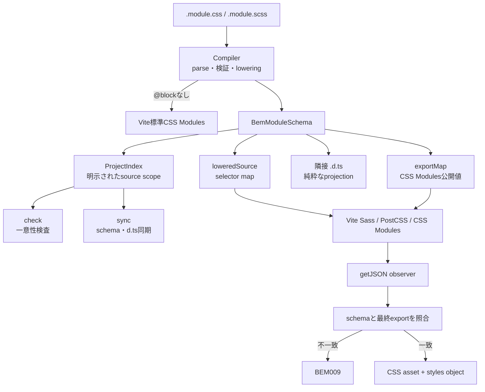

# 受け入れ契約

この仕様は、CSS ModuleをBEMの意味モデルへ変換するv0.1の契約です。利用方法は[`README.md`](README.md)、実装の所有者は[`docs/architecture.md`](docs/architecture.md)、作業の状態は[`PLANS.md`](PLANS.md)が案内します。

## 中心となるデータフロー

一つのCSS Moduleから作る`BemModuleSchema`を正本とし、CSS・CSS Modules export・型宣言を同じschemaから投影します。`@block`のないCSS ModuleはCompilerの結果にならず、Vite標準の処理へ委譲します。



## 機能一覧

| 領域 | 受け入れる機能 | 主な設定・境界 |
| --- | --- | --- |
| BEM変換 | `root`をBlock、その他のBaseをElement、separator付きclassをModifierとして分類する | `@block`が必要。ModifierにはBaseが必要 |
| flat API | `styles.root`、`styles.rootCompact`のように通常のCSS Modules exportから参照する | JavaScript / TypeScriptのsource transformは行わない |
| 命名 | `camel`／`kebab`、Element separator、Modifier separatorを選択する | `naming` |
| Modifier export | Modifierだけ、またはBase併記の値を返す | `modifierOutput: "only"`／`"withBase"` |
| Global class | BEM分類しないclassを元の名前で維持する | `globalScope.exact`／`prefix`、明示的`:global` |
| Compiler | 一つのsourceからschemaとlowered sourceを副作用なく作る | `ResolvedBemCompilerOptions` |
| Project | 明示されたsource集合のBlock名・生成class名を検査する | `project.include`／`project.exclude`／`project.startup` |
| 型生成 | schemaの公開keyを隣接`.d.ts`へ出力する | `types`、`bem-modules sync` |
| export検証 | Vite最終出力の欠落・不一致・未知の追加exportを検出する | `BEM009`、`getJSON` observer |
| Vite委譲 | Sass、PostCSS、CSS Modules、CSS asset bundlingをViteへ任せる | Vite adapterとしてのみ利用 |

## 公開APIと配布成果物

packageは一つのまま、rootから次を公開します。

- default export `bemModules`: Viteへ登録するplugin factory
- `defineBemModulesConfig`: Vite configとCLIで同じ設定objectを共有するidentity helper
- `isBemGlobalClassName`: global classの一致判定
- `BemModulesOptions`、`BemProjectOptions`、`BemProjectStartup`、`BemNamingOptions`、`BemGlobalScopeOptions`、`BemOutputSeparator`、`ModifierOutput`、`WordCase`

`BemModuleSchema`とCompiler / Projectの低レベル実装は、実consumerが生まれるまでpackage rootの公開契約に含めません。内部では耐久境界として個別にテストします。

source mapが参照する`src/`はtarballへ含めます。tarballの`bin.bem-modules`は実行可能な`dist/cli.js`を指し、次の二つのCLIを提供します。

```sh
bem-modules check
bem-modules sync
```

## Compiler契約

Compilerはfilesystem、Vite、module graph、HMR、`.d.ts`書き込みを知りません。解決済みの命名・global scope・Modifier出力だけを受け取り、BEM対象なら次を返します。

```ts
compileBemModule({
  filePath,
  source,
  options,
}): {
  schema: BemModuleSchema;
  loweredSource: string;
} | null
```

`filePath`には、呼び出し側でcanonicalizeしたabsolute filesystem pathを渡します。ファイル名の`?`をqueryとして解釈しません。Viteのmodule idからqueryを除く処理はVite adapterが担当し、相対pathはCompilerの内部契約の対象外です。

`schema`が意味の正本です。`classMap`はselector lowering、`exportMap`はCSS Modules公開値、schemaのclass keyはflat APIと`.d.ts`のprojectionに使います。Compilerの結果は同じ入力に対して同じ結果になり、Project stateやfilesystemを変更しません。

次の既存契約を維持します。

- `@block`がないModuleは`null`となり、Viteへ委譲する。
- `classMap`と`exportMap`を分ける。`modifierOutput: "withBase"`では両者の値が異なる。
- Sassの動的selector、`&--modifier`、selector内の`#{...}`、`@at-root`は、意味を確定できないため`BEM005`でfail closedする。
- Sassの`@extend`によるselector継承は対応しない。Compilerへ渡すsource内の`@extend`は、`!optional`やplaceholderを対象にするものも`BEM005`で拒否する。外部partialやmixinの内部までは検査しないため、それらを経由する`@extend`も使用対象外とする。宣言の共有にはselector継承を行わないmixinを使う。
- CSS Modulesの`composes`は`BEM007`で拒否する。

## Project契約

ProjectはViteのmodule graphではなく、filesystem上の明示された対象集合を所有します。集合は`root`と`project.include`から作り、`project.exclude`を差し引きます。

### 対象path

- `project.include`と`project.exclude`はglobではなく、root相対または絶対のfile / directory pathです。
- `include`を省略した場合はroot全体（`["."]`）を対象にします。
- `include: []`は空集合を意味します。暗黙の既定値へ戻りません。
- root外は暗黙importでは対象になりません。対象にする場合は絶対path（またはrootから解決できる明示path）を`include`へ追加します。
- 同じscopeはCSS Moduleと隣接`.d.ts`の走査、個別compileによるProject更新、削除に適用します。scope外のsourceや`.d.ts`はProjectの一意性検査・型同期の対象にしません。
- include配下の`node_modules`、`.git`、`dist`など既知の依存・生成・cache directoryはscope外です。ViteでimportしてもProjectへ登録しません。必要なfile / directoryを`include`で明示すると、そのpathを起点に対象へ含められますが、配下の無視directoryまで一括で解除はしません。
- rootや明示includeのsymlinkは実体pathへ正規化します。directoryの再帰走査ではsymlinkを辿りません。

### 検査と同期

`check`は対象集合を全走査してCompilerを実行し、Block名と生成BEM class名の一意性を検査します。importされているかどうかは結果を変えません。`sync`は同じ検査を通したschemaから隣接`.d.ts`を生成し、scope内のplugin-ownedな孤立生成物を掃除します。

Project stateはProject自身が持ちます。個別compile・削除・全走査が並行して呼ばれても、一意性検証と状態更新を途中で交差させません。失敗した個別compileの後始末も、その次の更新より先に終えます。Vite adapterがmodule graphの変化でschemaを追加・削除したり、到達性を一意性や型生成の条件にしたりしません。

## Vite Adapter契約

Vite adapterの責務は次の範囲です。

- 実体のあるCSS Moduleか、node_modules・virtual module・query境界の所有判定を行う。
- Compilerを呼び、`loweredSource`をViteへ返す。
- `getJSON`でVite最終exportとschemaの`exportMap`を照合する。
- Projectへの任意の`check` / `sync`起動をbuildやserveの契約へ接続する。
- CSS Module自身の変更時に再compileし、schema projectionが変わったときだけ必要なscript importerをinvalidateする。

`@block`のないCSS Module、virtual module、`node_modules`配下、通常CSS Moduleへの`?raw` / `?inline` / `?url`はVite標準処理へ委譲します。BEM対象に同じqueryが付いた場合は`BEM008`で拒否します。`css.modules: false`では変換・query検査・Projectの検査と型同期を無効にし、Vite自身の制約をそのまま適用します。有効時の`css.transformer: "lightningcss"`は`BEM004`で拒否します。

`project.startup`の既定値`"scan"`では、Viteの`buildStart`で明示scope全体をcheckまたはsyncします。`"defer"`ではこの起動時操作だけを行わず、到達したModuleのtransform・HMR・Project増分更新は維持します。CLIの`check` / `sync`は明示操作なので、このVite起動設定には従いません。

Viteの標準graph処理を優先し、HMRは正当性を保つ最小限の処理に留めます。importerが変更されただけでProject stateや生成`.d.ts`を変えません。CSSの再解析・同期に失敗した場合は旧schemaとplugin-owned生成物を残さず、エラーを再throwします。

## `.d.ts`のライフサイクル

`.d.ts`はschemaから作る派生物です。Viteの到達性ではなく、sourceとProject scopeを基準に扱います。

| 実行条件 | Projectのd.ts mode | 動作 |
| --- | --- | --- |
| serve、または`types: true` | `generate` | 対象scopeのBEM Moduleを生成・更新し、scope内の孤立plugin-owned生成物を削除 |
| buildで`types`省略 | `ignore` | 生成・削除しない |
| `types: false` | `remove` | 対象scopeのplugin-owned生成物を削除 |
| `bem-modules check` | `ignore` | 検査のみ |
| `bem-modules sync` | `generate` | 全対象を検査して生成物を同期 |

次の明示的な変化で生成物を削除します。

- source CSS Moduleが削除された。
- `@block`がなくなった。
- `sync`がscope内のplugin-owned孤立生成物と判定した。
- `types: false`で削除modeになった。

importされなくなった、またはVite module graphから到達できなくなっただけでは削除しません。既存`.d.ts`の更新・削除は、生成markerを持つ通常fileだけを対象にします。手書きfileやsymlink（リンク切れを含む）が生成先にある場合は`BEM006`で停止し、掃除では触れません。symlinkを根拠に参照先へ型生成の所有を広げません。
Projectのinclude / excludeを変更してscope外になった生成物も、安全のため自動削除しません。scope変更前の設定で`sync`またはremove modeを一度実行してから設定を変更してください。

## 命名と出力

- `wordCase: "camel"`ではflat keyをcamelCaseにし、既定のModifier separatorは`--`です。
- `wordCase: "kebab"`ではflat keyをcamelCaseへ投影し、Modifier separatorに`-`は指定できません。
- `elementSeparator`と`modifierSeparator`は`-`、`--`、`_`、`__`のいずれかで、同じ値にはできません。
- `root`はBlockそのものを表す予約語です。`globalScope`に一致してもBlockとして扱います。
- `modifierOutput: "only"`はModifierだけ、`"withBase"`は対応するBaseとModifierをexportします。
- `globalScope.exact`は完全一致、`prefix`は接頭辞一致でBEM分類を除外します。除外したclassは入力名のまま扱い、CSS escapeが必要な名前でもselectorとexportの同一性を保ちます。
- Project scope内の生成BEM class名とBlock名は一意でなければなりません。global classはその検査から除外します。

## CLIのshared config

CLIはrootの`bem-modules.config.mjs`、次に`bem-modules.config.js`を読みます。`--config`で別pathを指定できます。Vite config側も同じobjectを`bemModules(config)`へ渡してください。これによりnaming、globalScope、modifierOutput、project scopeがCLIとViteで分岐しません。

```js
// bem-modules.config.mjs
export default {
  naming: { wordCase: "kebab" },
  project: {
    include: ["src"],
    exclude: ["src/fixtures"],
  },
  types: true,
};
```

```js
// vite.config.mjs
import { defineConfig } from "vite";
import bemModules, { defineBemModulesConfig } from "vite-plugin-bem-modules";
import config from "./bem-modules.config.mjs";

const bemConfig = defineBemModulesConfig(config);
export default defineConfig({ plugins: [bemModules(bemConfig)] });
```

CLI options `--include` / `--exclude`は、shared configのpath scopeを明示的に上書きします。

## 非対応と診断

- CSS Modulesの`composes`は対応しません。
- BEM対象のselectorは静的class名で記述します。Sassの動的selectorは`BEM005`で拒否します。
- Sass partialやmixinがschema外のlocal classを出力した場合は、最終export検証の`BEM009`になります。
- `css.modules.localsConvention`でBEM APIのsource keyを削る設定は`BEM009`で拒否します。aliasを追加する設定は利用できます。
- framework pluginが生成するSFC内の`<style module>`など、実体pathを持たないvirtual CSS Moduleは所有外です。

| コード | 内容 |
| --- | --- |
| `BEM001` | `@block`コメントのBlock名が空、または不正 |
| `BEM002` | 1つのCSS Moduleに`@block`が複数ある |
| `BEM003` | class名、Modifier、Block、生成class名の規則違反または衝突 |
| `BEM004` | 設定値またはCSS transformerが対応範囲外 |
| `BEM005` | Sassの動的selectorまたは非対応の`@extend`を検出 |
| `BEM006` | 隣接`.d.ts`がplugin-ownedではない |
| `BEM007` | CSS Modulesの`composes`が使われている |
| `BEM008` | BEM対象に`?raw` / `?inline` / `?url`が付いている |
| `BEM009` | Viteの最終CSS Module exportがschemaと一致しない |

## 保留

layer単位のCSSファイル生成、layerの出力制御、framework固有virtual moduleの型生成は、この契約には含めません。
